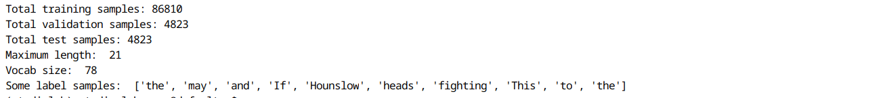
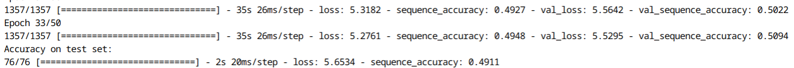

# OCR Convolutional Recurrent Neural Network

## Installation
```bash
git clone https://github.com/dleqhuy/ocr_crnn.git
```

```bash
pip install -r ocr_crnn/requirements.txt
```

## Data prepare
```bash
gdown https://drive.google.com/uc?id=1Fyc8ihAt0TrRQE7HFE9pSqBs0Cows_O5
unzip -qq data.zip
```

```bash
python ocr_crnn/crnn/prepare.py \
--config ocr_crnn/configs/text_recognition.yml \
--dir data
```
### output

 

## Train
```bash
python ocr_crnn/crnn/train.py \
--config ocr_crnn/configs/text_recognition.yml \
--save_dir ocr_exp1
```
### output

 

## Demo
```bash
python ocr_crnn/crnn/predict.py  \
--config ocr_crnn/configs/text_recognition.yml  \
--weight ocr_exp1/best \
--images ocr_crnn/example/images  \
--post greedy
```

### output
