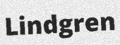
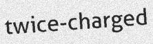
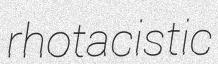
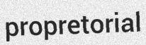

# OCR Convolutional Recurrent Neural Network

## Installation

```bash
pip install -r requirements.txt
```

## Data prepare
```bash
trdg --output_dir /content/drive/MyDrive/data -c 2000 -t 4 -w 1 -f 64 -k 5 -rk -do 0 

python ocr_crnn/crnn/prepare.py \
--config ocr_crnn/configs/text_recognition.yml \
--dir /content/sample_data
```

## Train
```bash
python ocr_crnn/crnn/train.py \
--config ocr_crnn/configs/text_recognition.yml \
--save_dir /content/drive/MyDrive/ocr_exp1
```

## Demo
```bash
python ocr_crnn/crnn/predict.py  \
--config ocr_crnn/configs/text_recognition.yml  \
--weight /content/drive/MyDrive/ocr_exp1/10_0.2286_0.9502.h5 \
--images /content/ocr_crnn/example/images  \
--post greedy
```

## Results
| Ground truth 	| Prediction 	| Image 	|
|--------------	|------------	|-------	|
| detector 	    | detector 	    |  	    |
| paraproctitis | paraproctitis |  	|
| Lindgren      | Lindgren      | 	    |
| twice-charged | twice-charged | 	|
| Tindale       | Tindale       | 	    |
| rhotacistic   | rhotacistic   | 	|
| encephala     | encephala     |  	    |
| fissive       | fissive       |  	    |
| microphagous  | microphagous  | 	|
| propretorial  | propretorial  |  |
